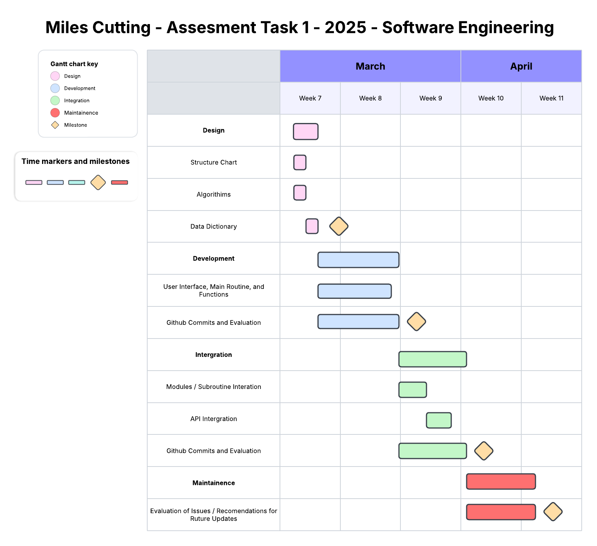
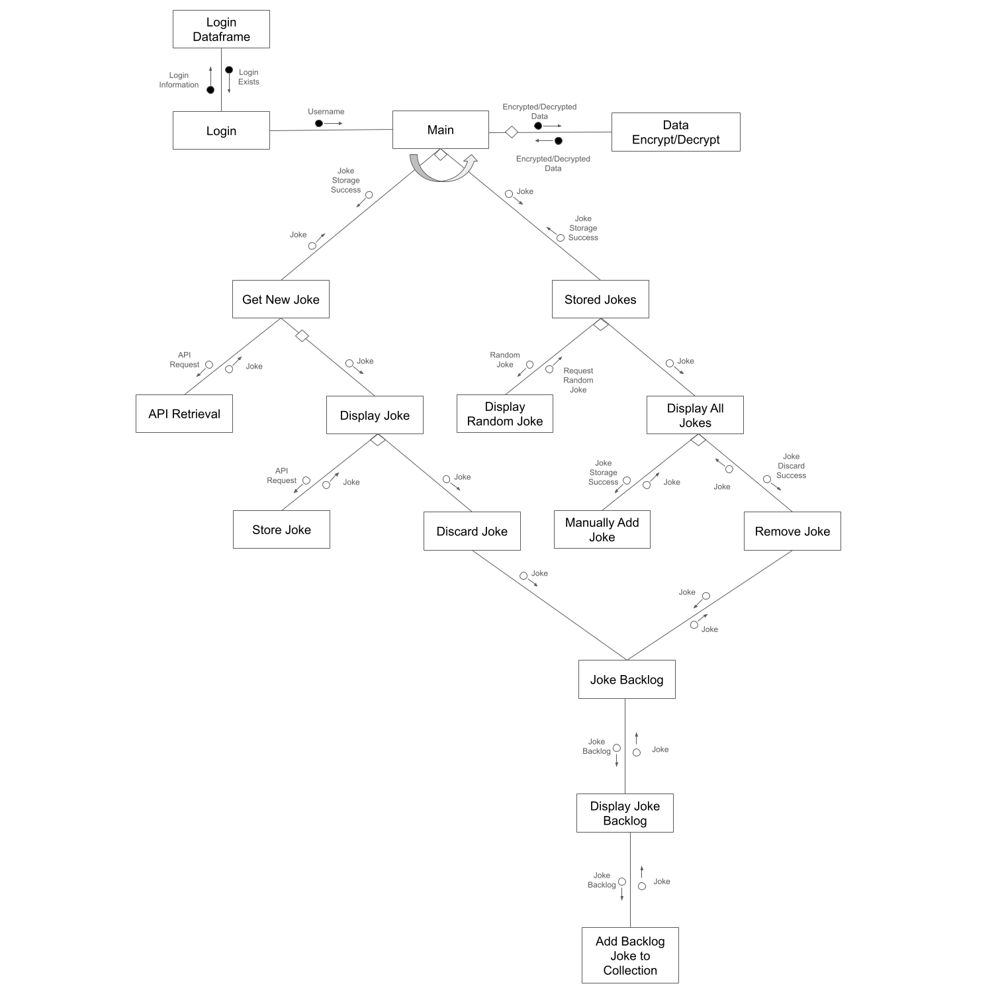
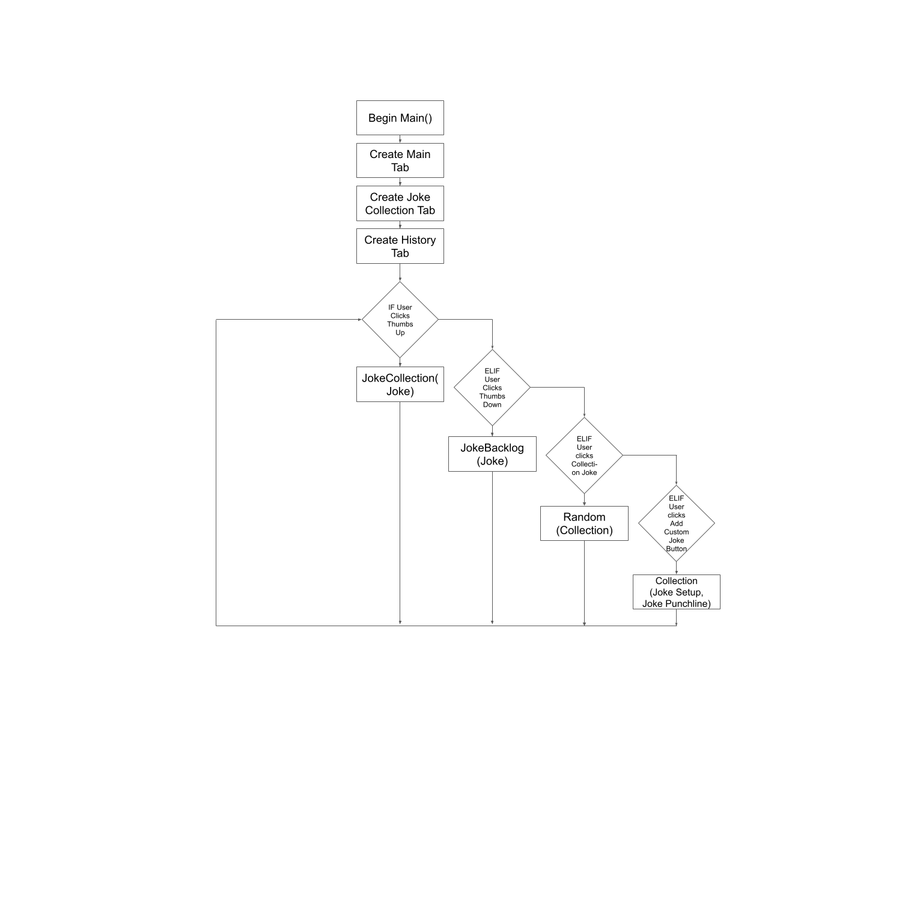
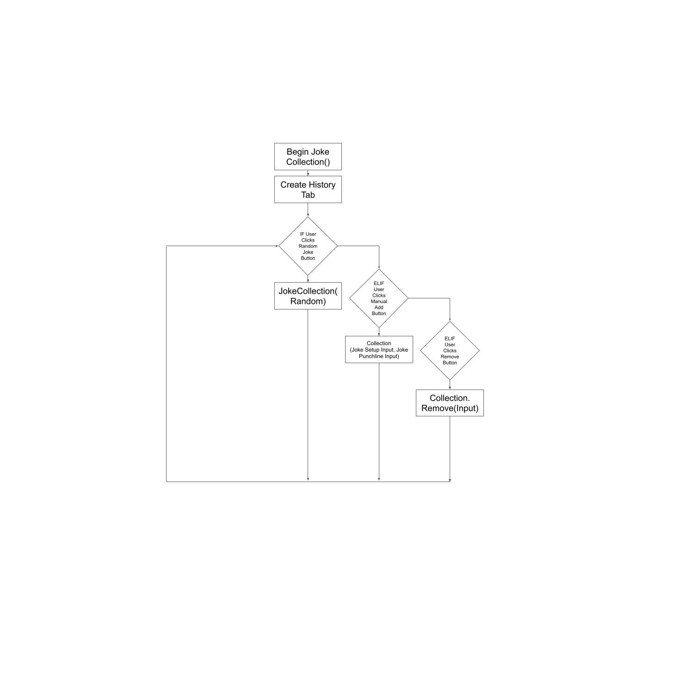
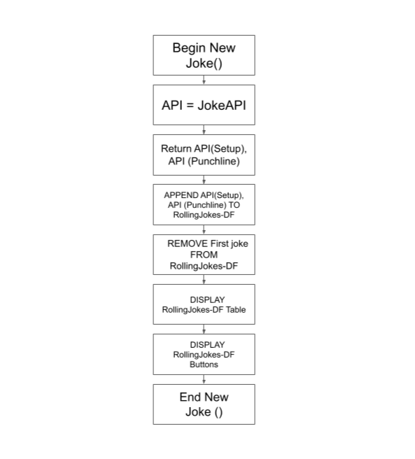

# <ins> **10SE - Miles Cutting - 2025 - Assessment Task 1 - Data Science** <ins>

## <ins> Requirements: <ins>
***
### Functional Requirements:
* Data Retrieval: The user needs to be able to easily and effectively read a joke, then decide, through the use of interactive buttons, if the joke is good, and worth putting in their collection, or bad, and discarding it. After the decision, the user is presented with a new joke. At any time, the user can look at all their jokes in their collection, which is is a table, storing their jokes, and punchlines.

* User Interface: Their needs be be several key elements for the user to interact with. The first is a 'tab' system, that has a main page, a collections page, and a history page. The main page will have text on the screen that says the joke, and underneath, it will contain a thumbs up and thumbs down button, the thumbs up button will save the joke in the users collection folder. The thumbs down button will discard the joke, then the joke disappears and a new one is added. The collections page will display a table for the user to scroll through that contains the joke and the punchline. It will have two actions that the user can interact with, A 'random button', which presents a random joke from their collection, and a 'Add Joke Button', which manually lets a user enter a joke into their collection. The history tab will have the history of the previous jokes/actions they have interacted with.

* Data Display: The user needs to obtain key information from the system. On the Main tab, a visual pop-up with the joke needs to show up, the second is visual feedback on their actions with the joke, i.e If they added it to their collection, they get visual feedback to see it go into their collections, or if they discard it, they receive visual feedback to see that it has not entered their collection. On the collections tab, the user needs clearly to see the joke they receive when they click the random joke button. The second is visual feedback that the joke they have entered into the system, has gone into their collections folder.

### Non-Functional Requirements:
* Performance: The system needs to give the user real time feedback of what is happening. This will involve ensuring the animations and actions happen as soon as possible. This requirement will be achievable, because of the minimum processing happening on the device itself.

* Reliability: There are two parts of the software that will cause the software to become unreliable or not function as intended. The first of these is the user. The system will have very few points where the user can incorrectly enter information or make a mistake, this means that the software will have very few points of failure from user error. The second part that can have issues with reliability is the api. Changes with how the api functions can impact how the software will run. To ensure these possible issues are communicated to the user, an effective error message handling system is required in the final product. Another layer of protection to support the user in possible issues, is storing the collections on the individual device, which will mean that even with issues with the api, a collection of jokes will still be accessible.

* Usability and Accessibility: The system needs to be intuative enough for someone with little to no computer literacy to effectively use the software, with the only information given to them is the functionality of the software. i.e It curates and stores jokes. To accomplish this, I want to use a range of icons, and labeled buttons, such as thumbs up and thumbs down, and tabs with names, such as Main, Collection, and History.

## <ins> Specifications: <ins>
***
### Functional Specifications:
#### User Requirements:
* Select whether a joke is good, and worth keeping in their collection, or not, and be discarded.
* View their collection of jokes in a easy to read table that separates the main line and the punch line.
* Manually add a Joke to their collection.
* Find a random joke from their collection.

#### Inputs and Outputs:
* **Input** - The Joke from the API - **Output** - The joke in text on the main screen of the program
* **Input** - The Users Feedback on the joke, i.e Keep or Discard - **Output** - A visual representation of the joke being discarded or kept, then being replaced with a new joke
* **Input** - The user manually enters a joke into the Collection - **Output** - The collection actively updating with their joke included in it
* **Input** - The user selects the random option under the collections tab - **Output** - The user receives a random joke from their collection pop up on their screen.

#### Core Features and Mechanics:
* Jokes are provided to the User to store
* Jokes are kept in a collection
* Jokes can manually be added to the users collection
* Random jokes can be got from the users collection

#### User Interaction:
* The User will interact with the program via a GUI made with tKinter
* To make the UI as useable as possible, their will be a large array of icons to effectively convey the utility of the button or Labeled buttons, what make it clear and evident the functionality it provides to the user

#### Error Handling:
* Their are very few points of error that could cause problems in the program. The two main points of error are the API, and the user interface. To handle problems with the API, the best solution for handling this  is the use of error messages that advise the user on how to handle the issues. These handling solutions could be to try reloading the API call, with how to do that on the Error message, or to avoid functionality the API relies on, i.e Only using the collections functionality. The main issue with the UI, is the user clicking the wrong button. To avoid this, keeping a short backlog of key information can help with ensuring the user has time to realize their mistake, and correct the dat from the backlog. To do this, keeping a backlog of the previous 3 jokes, and making them reachable to change, i.e add or remove from their collections.

### Non-Functional Specifications:
#### User Interaction:
* To keep the user satisfaction at it's highest, it is important that the program is keeping up with the user. The main bottleneck which will slow the user's experience is the API calls. If the User is making requests as they need a joke, they will be slowed by both their internet connection, and the speed of the API centre. To counter this, I can have a line up of 3 jokes before their current one, so while they are looking at a new joke, the API is calling for a new one. This means that the user is never waiting for the API to process, and will result in higher user enjoyment and satisfaction with the end product.

#### Useability / Accessibility:
* To keep the software as accessible as possible, ensuring it uses generic system level interactions, i.e Mouse and Keyboard, will mean that the software will automatically be useable with any specialty user controllers that assist in movement and useability. i.e Many people with limited movement skills uses custom controllers to navigate their computer, that have custom text inputs, and pointer inputs.

#### Reliability:
* The system has few points where it can cause a problem with the the functionality of the program. The two main areas where the problems may arise are the User entered portions, and the API retrieval. If the user doesn't correctly enter in data, i.e leaves a portion of a fill in blank, the program will have to check, and return information to the user about how to fix the problem. The next largest issue is the API retrieval. To solve this, having a check for the API's error codes before it displays the information will work to effectively ensure their are no problems with the system.

## <ins> Use Cases: <ins>
***
Actor: User (A Funny Person)

Preconditions: Internet access; API with jokes is available.

Main Flow:

Get Jokes – The user cycles through jokes, clicking to store or discard them; system gets and displays the jokes.

Store Jokes – User adds the jokes to their collection; system confirms storage.

Random Jokes – User requests random joke from their collection; system retrieves and displays a random joke from their collection.

Visualise Jokes – System displays a table with every joke, separating the setup and punchline.

Remove Joke – User deletes a joke from their collection; system updates storage.

Postconditions: Joke data is retrieved, stored, randomized, displayed, or removed successfully.


## <ins> Design: <ins>
***

### Gantt Chart:


### Structure Chart:


### Algorithms:

#### Main Pseudocode:
```
BEGIN Main()
    GetNewJoke = Tab Button
    JokeCollections = Tab Button
    History = Tab Button

    DISPLAY Get New Joke()
    DISPLAY Thumbs Up Button
    DISPLAY Thumbs Down Button

    DISPLAY Collection Joke
    DISPLAY New Collection Joke Button

    DISPLAY Add Joke Setup
    DISPLAY Add Joke Punchline
    DISPLAY Add Custom Joke Button

    WHILE TRUE:
        IF User Clicks Thumbs Up:
            JokeCollection(Joke)
        ELIF User Clicks Thumbs Down:
            JokeBackLog(Joke)
        ELIF User clicks 
        ELSE:
            PASS
        ENDIF
    ENDWHILE
END Main()
```



#### View Collection:
```
BEGIN JokeCollection()
    Collections[] = Collections.CSV
    DISPLAY Collections[]
    DISPLAY Random Joke Button
    DISPLAY Random Joke
    DISPLAY Manual Add Button
    DISPLAY Remove Button

    WHILE TRUE:
        IF User Clicks Random Joke Button:
            JokeCollection('Random')
            DISPLAY Random Joke

        ELIF User Clicks Manual Add Button:
            NewJokeSetup(DISPLAY Text Box - Setup)
            NewJokePunchline(DISPLAY Text Box - Punchline)
            Collections[].APPEND(NewJokeSetup, NewJokePunchline)

        ELIF User Clicks Remove Button:
            RemoveJoke(DISPLAY Text Box - Which Joke?)
            Collections[].REMOVE(RemoveJoke)
        ELSE:
            PASS
        ENDIF
    ENDWHILE

END Main()
```



#### Get New Joke
```
BEGIN JokeCollection()
    API = JokeAPI
    Return API(Setup), API (Punchline)
    
    APPEND API(Setup), API (Punchline) TO RollingJokes-DF
    REMOVE First joke FROM RollingJokes-DF

    DISPLAY RollingJokes-DF Table
    DISPLAY RollingJokes-DF Buttons

END Main()
```



### Data Dictionary: (Format For Joke Collection Storing)
| Variable | Data Type | Format for Display | Size in Bytes | Size for Display | Description | Example | Validation |
| :---- | :---- | :---- | :---- | :---- | :---- | :---- | :---- |
| Joke index in Table | Integer | NNNN | 4 | 4 | A unique code for each joke, to make sorting for random jokes faster and more reliable. | 1385 | A 4 digit long code |
| Joke Setup | String | XXX…XXX | 200 | 200 | The setup of each joke | A man walks into a bar | A string under 201 characters |
| Joke Punchline | String | XXX…XXX | 200 | 200 | The punchline of each joke | His friend says, are you okay? | A string under 201 characters |


### Testing and Debugging: Project Development Commits
#### 03/03/2025: School  
Created the files I would be using over the timeline of the Assessment Task which included:  
 \- main.py  
 \- README.md  
 \- requirements.txt  
 \- PROJECT\_DEVELOPMENT.md  
Then I passed the scaffold for the task into the Project Development file.

This will help me stay focused with clear goals for what to be working on/towards.

The next step is working on determining the requirements and specifications.

#### 04/03/2025: School \+ Chapman Centre  
Finished the Functional and Non-Functional requirements of the task, and have started to work on the Functional and Non-Functional specifications.

This will give me clear goals, requirements, and achievements when working on the task.

Next is finishing the specifications and moving onto the next part of the theory.

#### 05/03/2025: School  
Finished the majority of Functional and Non-Functional Specifications.

This will give me a clear set of guidelines to work towards during the task.

Next is finishing Specifications and starting work on use cases, then the charts.

#### 07/03/2025: School  
Started to work on use Cases, with still a few parts of specifications to finish.

Use Cases will give me a good guide for the intended workflow of the program, and give me more guidance on how the system will work together.

Next is finishing specifications and Use Cases, then finishing the charts.

#### 10/03/2025: School  
Finished Specifications, Use Cases, and started working on charts.

The charts will provide a good visual representation of the program, and other crucial details, such as time management.

Next is finishing the charts and design part of the project.

#### 11/03/2025: School  
Finished most of the design, the rest I will finish once I Have completed the task to better understand how it all fits together. I also started work on the task, pulling code from old projects as a starting point for the current project. This consisted of mostly elements for the tKinter GUI, such as how to set up frames (Tabs), and changing names and sizes for windows, however not lots was transferable.

This will provide me a good foundation to start building my code from, since it has been proven to work for the same goal.

The next goal is integrating the API and getting it working.

#### 17/03/2025: School  
When I started designing the project, I originally intended to use the JokesOne API, found here: https://jokes.one/api/joke/\#jodc-python, but due to its nature of being a for-profit project, with the free functionality being at best having extremely limiting functionality, and at work being completely unusable. However, I was able to find a new API, which is missing a range of features that the JokesOne API had, and is still much easier to use and integrate. It is called https://deno.land/x/joke@v2.0.0. It requires no API key, which will simplify the integration process. It's only key limiting factor, is it doesn't have as large of a range of jokes, and then all the jokes it does have are mostly cringe.

With the API working most of the time, I will have lots of data to add into my program to get more key elements working effectively

The next goal is getting the API working every time, and storing the data in a Pandas Dataframe.

#### 18/03/2025: Home  
After a bit of playing around with the API, and referencing the example code for how to get it working, it is working consistently, and providing new jokes on command within a text based interface. The issue I was having with it was I was trying to call a specific type of joke i.e a Programming Joke, and I implemented that feature wrong. However, I won't use this feature due to the small amount of jokes in the API.

This will mean I can eliminate causes for errors easier when working with the API, since I know it is working.

Next is implementing it into the Pandas Dataframe.

#### 19/03/2025: School   
Today I started implementing the Jokes into a Pandas Dataframe, making storing, and manipulating them easier. As of now, it prints the new joke in the GUI, and a button replaces it with a new joke from the API, and depending on which button, discards it or adds it the the dataframe.

This will be important to have working for later integration with the system as a whole.

Next is working on viewing the Collection as a whole.

#### 24/03/2025: School  
Now the Data is being stored in a Pandas dataframe, displaying that data to the user is the next step. To do this, I found a python program called \`pandastable\`, that is designed to put a 'Excel' like experience, in a tKinter GUI, and is specifically designed to work with pandas dataframes. This will be a vital tool to use in my program, and will be perfect for how I want to display my data to the User. I implemented this into the second frame of my tkinter window.

These changes will change how I store data in the future, to make it better fit in the Pandastable.

Next is Saving the data frame as a CSV file to be usable across sessions of running the program.

#### 25/03/2025: School  
There was a range of different ways I could have approached saving the Dataframes as a CSV, my first option was to save it as a CSV on every interaction the user had with the software, however, I also wanted to encrypt the data, and it resulted in being too much for the program to handle. My next idea was to save it every time it closed, where sir was able to help me find code for tkinter that changed the function of the 'X' button, and allowed me to convert it every time the program was closed.

This will also allow for easier integration with the encryption process I want to add later.

The next few steps are adding a Login Feature to individually assign a login to each user, and add encryption for each user's collection.

#### 30/03/2025: Home  
Now I had the Jokes being stored, I added a login function that ran before the main Joke program that allowed the user to enter a username and password to login, or create a username and password. Then it SHA256 encrypts the password, ensuring the Password cant be reverse encrypted to login into someone else's account. Now when the program is running, it stores each individuals jokes under their user folder, in 'Collections.csv'

This will keep user specific data together, and will increase the utility of the program for different people using it. 

Next is encrypting the Users CSV files to keep them secure.

#### 31/03/2025: School   
Today I added encryption for the CSV Files through the use of \`cryptography\`, which when the user opens the program and logs in, it decrypts their CSV file. After they close the program, it re-encrypts the CSV file. However, it still has some minor issues that still need to be fixed.

This makes the entire program more secure, greatly increasing the utility of the software. 

Next will be improving the encryption to make it more seamless, and work more reliably.

#### 31/03/2025: Home  
Finished getting encryption working properly, now it consistently encrypts and decrypts files.

This will give confidence to my users in their security. 

Next will be working on making the system as a whole look better, and adding key features, such as my Rolling Joke API.

#### 01/04/2025: Home  
Today I worked on fixing the Login GUI, making use of the .pack() tkinter commands. Now it looks better, and has a range of key features, such as having default text that says 'Username' etc, that removes when the user starts to type. It also makes it more clear and manageable to look at. I also added a hide password feature, that can hide the password being entered by the user.

This simplifies the login experience, making it more clear the features and role of each of the buttons in the Login.

Next is making the Main program screen look better.

#### 02/04/2025: School  
For the main login screen, I added a background colour, and added variables for them, making it simpler to switch between colours and test colours for backgrounds and accents. I also unified the layout closer to the layout for the login, making it simpler to understand. 

This will improve how the user interacts with the system, but I am still having problems with it, most notably the buttons for storing and discarding jokes aren't going next to each other, which is an important layout design I want for my program.

Next is adding key features, and further improving the UI of the main program.

#### 02/04/2025: Home  
Added 2 key features, which were the Random Joke from collection, and the manually adding jokes. Then I further improved the home screen to accommodate these features being added. To solve the buttons being next to each other, I created a new frame inside of the existing frame, and put the buttons on the left and right side of that smaller frame. While working on this however, I found an issue with the login function, which was the password hider isn't working correctly.

These features are critical in this kind of program, and adding them has improved the experience with using the software, making it more customisable for the user. Adding these features was also simple, because the extensive infrastructure that runs them was already there for the other features. They work well and will be a great addition to the software.

Next is fixing some issues with the code, and the code structure.

#### 03/04/2025: Home  
The way I was doing colours in my program was very poor, so I completely redid it, making them all tied to two variables, one for background colour, and the other for the accent colour. Furthermore, I fixed problems with the remove row feature. (Also side note: I had Jamie do some testing of the program, and he tested the remove row feature. I don't know how he did it, I have tried to reproduce what he has done, doing exactly what he did, but he somehow managed to delete the entire first column instead of the row. I don't know how he did it. But I tried for a good few hours to fix it. If it happens to you, please let me know how you did it. I cannot figure it out. Or maybe I fixed it and it won't happen again, I can only hope)

Fixing these features means the user can fully control their collection, making it personalised to their taste in jokes, making them effective features to get working correctly.

At school, I will keep working on fixing minor issues, and patching issues, specifically around user entered content.

#### 04/04/2025: School  
Today I fixed a few minor issues, most notably the Show Password feature still had some minor tweaks that needed to be fixed. To do this, I put it into a function that would show and hide passwords. I also converted it to a tkinter Bool Variable, which made it work better with the tkinter Checkbox it was connected to.

This minor improvement just fixes issues with the existing software, making it a not very impactful change to the overall software.

Next is adding the Rolling API feature that adds the ability for the user to look at their history, and speed up the process of retrieving the API.

#### 04/04/2025: Home  
Added the Rolling API function, allowing the User to view their history whenever they remove a joke, discard a joke, or other functions. My first idea for this used nested lists, but this proved difficult to impliment into the Pandas pipeline.

One key issue I found when implementing this, is because of how my code ran, the main advantage of it 'Running Faster' because it was getting it in the background turned out to not work because the program wouldn't continue until it had received the joke, making it only useful as a history tool, which is still an important and useful feature for my program.

Next if polishing the code and theory component of the task.

#### 05/04/2025: Home  
Today I finished implementing all of the final features of the code, making sure they all worked properly, and fixed some minor issues with it, mostly revolving around the Rolling API feature. Then I went through and put comments through most of the code, highlighting what every feature of the code does, and how it works.

This process ensures the user has a great experience wit has few errors as possible.

Tomorrow's job is to finish the code comments.

#### 06/04/2025: Home  
Finished the code comments, and Finished the theory element of the project.

#### 07/04/2025: School
Polished of a few parts of the theory.

Next at home is finishing the flowcharts.

#### 07/04/2025: Home
Finished the Flowcharts, README.

Next is getting clarification on the data dictionary and submitting.

#### 08/04/2025: School
Got clarification on the Data dictionary, and am now submitting the task.


### Maintainence:
1. The API I used has been running for a long time, with little to no changes in the amount of data, and the format for the data, however, in the event of it changing, because of How I handled implementing the API, the user would still be able to use a range of features and elements of the software until I fixed it. Fixing it would be a simple process, changing only a few lines of code. If the API completely shut down, it would still be quick, easy, and effective to switch to another API that provides similar functionality.

2. When designing my program, Pandas specifically mentioned the use of specific functions losing functionality in later updates of python, which was the Append method that added rows to dataframes. So while I was developing the program, I took notice of which functions where going to remain in service, and which ones wouldn't. IDK

3. After deployment, if I found a Bug, I would alert the users of the software, letting them know their was an issue with the program, what parts of the program it affected, and provide a helpful work around until the problem could be addressed, and a rough timeline for solving the problem. Then I would start working on solving the problem, and release a new version of the software to the user base, with the bug fixed.

4. Due to the extensive documentation throughout my code, I can easily use the ctrl+f feature to find elements of my code that preform different actions, then read the comments for what each line does easily, and effectively.

### Evaluation:
1. My program meets all of my functional and non-functional requirements and specifications effectively and completely, and then adds more features on top of it. While my program doesn't look or function in the way I first intended and wanted it to, it still met the criteria I set in a effective way. 

2. Their are 3 key areas where I feel as though my program could be improved upon. The first is my rolling joke feature to pull the API in the background didn't work, slowing the software. With more experience with python and programming as a whole, this is something I believe I can achieve, however with my limited knowledge, it was beyond the scope for this project. The next key feature I wanted to add was specialised/themed jokes. In the API I used, and many API's like it, it gave a theme that the joke fell under, such as Programming Joke, or Animal Joke. Allowing the user to chose these specific jokes would be an excellent feature to add, however the API's repository of jokes was very small, and adding this feature would mean the Jokes presented would be repeating. Building on that point, the final thing I would improve upon again in this program is using a different API, that provides more features and content to be explored in the program.

3. My time management with the project wall overall very good. I have finished it almost a full week before the due date, and every time I worked on the project, it was meaningful improvements, that contributed heavily towards the final product. However, the project I made wasn't correctly scoped for this project, with the timeline of development for the project being to variable, which led me adding non-critical features before more important ones, which led to my code being more complex than it needed to, or should have been. If I where to do this project again, I would spend more time on the theory at the start of the project, and add a new section just for my use, that clearly states what feature I will add, How I will add it, and how it will interact with the program. While my code is still very light and easy to run, their are a range of improvements I could have made to it that would have improved its functionality, scalability of features, and usefulness as a program.

### Peer Evaluations:

Rufus:
> generally good program but lacks some polish and is somewhat annoying when trying to view joke collection as you half to scroll after every input or it is not visible. I disliked some of the jokes as well. All in all 7/10

Max:
> I thought the user interface was very polished, with nice tabs and login; it could have used instructions or a help screen at times, but all in all, very nice program, would get for my computer if I could.

